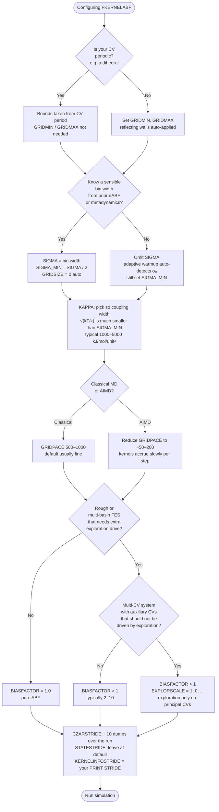

# FK-eABF

A toolkit for running FK-eABF (Force-Kernel eABF) enhanced sampling simulations in PLUMED and recovering free energy landscapes from the results.

FK-eABF is an adaptive biasing force method that uses an extended Lagrangian (fictitious particle λ coupled to the real collective variable z) and a kernel-based mean force estimator. The CZAR estimator on the real CV z provides an unbiased free energy gradient that is integrated into a free energy landscape in post-processing.

---

## Requirements

- PLUMED (with `forcekernel.cpp` compiled as a plugin via `LOAD`)
- A MD engine supported by PLUMED, or the built-in `pesmd` toy integrator for 2D potentials
- Python 3 with NumPy and SciPy for post-processing

---

## Workflow

### 1. Setting up an FK-eABF simulation

The plugin is loaded at runtime via the PLUMED `LOAD` directive — no recompilation of PLUMED is required. Configure your `plumed.dat` to load the plugin and define the `FKERNELABF` action:

```plumed
LOAD FILE=./forcekernel.cpp

cv: <YOUR_CV_DEFINITION>

fk: FKERNELABF ...
    
    # CV Definition
    ARG=cv

    # Extended Lagrangian Options
    KAPPA=3000.0          # coupling spring constant (kJ/mol/nm^2)
    TAU=0.5               # fictitious particle time constant (ps)
    FRICTION=8.0          # Langevin friction (ps^-1)
    TEMP=300              # temperature (K)

    # FK-eABF Options
    GRIDMIN=-1.5          # CV domain lower bound
    GRIDMAX=1.5           # CV domain upper bound
    SIGMA=0.05            # initial kernel width
    SIGMA_MIN=0.01        # minimum kernel width
    GRIDSIZE=100

    # Data Accumulation and Biasing Force Update options
    PACE=5                # steps between data accumulation
    GRIDPACE=1000         # steps between biasing force updates

    # Output options
    CZARSTRIDE=50000      # steps between CZAR kernel file writes
    KERNELINFOSTRIDE=500  # match this to your PRINT STRIDE
...

PRINT FILE=COLVAR STRIDE=500 ARG=*
```

#### Parameter selection at a glance

If you're setting up a new system, the following decision tree walks through the main parameter choices in roughly the order they should be made:



**TLDR; set `SIGMA`, `SIGMA_MIN`, and `GRIDSIZE` (plus `GRIDMIN`/`GRIDMAX` for non-periodic CVs). Everything else can be left at its default.** The three parameters above are technically optional but should be treated as mandatory in practice — getting them right is the difference between a simulation that converges efficiently and one that wastes compute time.

**SIGMA and SIGMA_MIN.** `SIGMA` is the initial kernel bandwidth; `SIGMA_MIN` is the floor below which adaptive Silverman rescaling cannot shrink it. Omitting `SIGMA_MIN` lets the kernel population grow without bound as the bandwidth contracts, wasting memory and slowing the kernel search. Use the bin width you would adopt for eABF as a guide: set `SIGMA` to that value and `SIGMA_MIN` to half of it (e.g., a 5° dihedral bin → `SIGMA` ≈ 0.087 rad, `SIGMA_MIN` ≈ 0.04 rad).

**GRIDSIZE.** The mean-force grid is where NW regression is evaluated and multilinearly interpolated between rebuilds. The grid resolution does not affect kernel accumulation or the recovered free energy — it controls how faithfully the cancellation force is applied between updates. By default (`GRIDSIZE=0`), FK-eABF auto-sizes the grid so that spacing equals `2 × SIGMA_MIN` (the effective kernel diameter), with a floor of 72 points per dimension. An explicit `GRIDSIZE` producing coarser spacing triggers a warning but does not abort the run.

#### Compulsory Keywords

| Keyword | Default | Description |
|---------|---------|-------------|
| `ARG` | — | Collective variables (1–3 supported). |
| `KAPPA` | — | Spring constant(s) for z–λ coupling (kJ/mol/unit²). Larger κ → tighter coupling, smaller σ = √(kT/κ). One value or one per CV. |
| `TAU` | `0.5` | Oscillation period(s) of λ (time units). Sets the fictitious mass m = κτ²/(4π²). |
| `FRICTION` | `10.0` | Langevin friction on λ (1/time_unit). One value or one per CV. |
| `TEMP` | `300.0` | Temperature (K). |
| `PACE` | `5` | Force-sample deposition interval (MD steps). |
| `THRESH` | `1.0` | Kernel merge threshold in σ-normalised distance. OPES standard; lower → more compression, higher → more kernels. |
| `NSIGMACUT` | `4.0` | Kernel cutoff in σ per dimension for NW regression. 4.0 gives <2% contribution at the boundary. |
| `BIASFACTOR` | `1.0` | Exploration factor γ. `1.0` = pure ABF. `>1.0` adds density-based exploration on λ via V_ex = c·ln(1 + Z/Z₀) where c = kT(γ−1). The CZAR estimator on z is unaffected. |
| `EXPLORSCALE` | `1.0` | Per-CV scaling of the exploration force. `0.0` disables exploration on that CV (e.g., `1.0, 0.0` to drive only the first of two CVs). |
| `MUXCLAMP` | `500.0` | Per-kernel mean-force clamp on absorption (kJ/mol/unit). |
| `MAXFORCE` | `500.0` | Grid mean-force clamp per node before interpolation (kJ/mol/unit). |
| `GRIDSIZE` | `0` (auto) | Grid points per dimension. Auto-size: N = ceil(range / (2 × SIGMA_MIN)), floor 72. Defaults to 72 when `SIGMA_MIN` is unset. |
| `GRIDPACE` | `500` | Mean-force grid rebuild interval. Reduce for AIMD. |

#### Optional Keywords — Bandwidth

| Keyword | Default | Description |
|---------|---------|-------------|
| `SIGMA` | *(auto)* | Initial kernel bandwidth σ₀. Omit entirely for adaptive mode (CV variance measured during an unbiased warmup). |
| `SIGMA_MIN` | *(none)* | Bandwidth floor. Set to roughly half `SIGMA` so free-energy resolution can sharpen with more sampling. |
| `ADAPTIVE_SIGMA_STRIDE` | `10 × PACE` | Length of the unbiased warmup for automatic σ₀ determination. Used only when `SIGMA` is omitted. |
| `FIXED_SIGMA` | `false` | Disable Silverman rescaling — all kernels use σ₀ permanently. |

#### Optional Keywords — Grid Bounds

| Keyword | Default | Description |
|---------|---------|-------------|
| `GRIDMIN` | *(from CV)* | Lower grid bound(s) for non-periodic CVs. Reflecting walls applied automatically. |
| `GRIDMAX` | *(from CV)* | Upper grid bound(s) for non-periodic CVs. |

#### Optional Keywords — Neighbor List

| Keyword | Default | Description |
|---------|---------|-------------|
| `NONLIST` | `false` | Disable the neighbor list (brute-force kernel search). |
| `NLIST_PARAMETERS` | `3.0 0.5` | Cutoff factor and skin factor. Includes kernels within `cutoff × NSIGMACUT × σ`; rebuilds when the query point drifts by `skin × dev²`. |

#### Optional Keywords — Output Files

All filenames are derived from the action label (e.g., `fk: FKERNELABF ...` → `fk.*`).

| Keyword | Default | Description |
|---------|---------|-------------|
| `CZARSTRIDE` | *(off)* | Step-stamped CZAR z-kernel snapshots → `{label}.czar_kernels_{step:08d}.dat`. Feed to `czar_integrate` to recover A(z). |
| `KERNELSTRIDE` | *(off)* | Step-stamped λ-kernel snapshots → `{label}.kernels_{step:08d}.dat`. |
| `LAMBDAGRIDSTRIDE` | *(off)* | NW mean-force debug grid every N steps → `{label}.lambda_grid_{step:08d}.dat`. Bias force on the λ grid, **not** the free energy. |
| `STATESTRIDE` | `CZARSTRIDE`, else `10 × GRIDPACE` | Restart state cadence → `{label}.state.dat` (overwritten in place). State is also written automatically whenever the MD engine writes its own checkpoint. See [Restarts](#restarts) below. |
| `KERNELINFOSTRIDE` | `PACE` | Kernel diagnostics line every N steps → `{label}.kernelinfo.dat`. **Set this to match your `PRINT STRIDE` (e.g. 500); the default of `PACE` writes at every kernel deposition and adds significant I/O overhead.** |

<br>

---

<br>

### 2. Running the simulation

For the included Müller-Brown benchmark, run with PLUMED's built-in 2D toy integrator:

```bash
plumed pesmd < pesmd.in
```

This executes the simulation defined in `pesmd.in` (10M steps on the 2D Müller-Brown potential) driven by `plumed.dat`, and writes CZAR kernel snapshots at the configured stride.

#### Restarts

FK-eABF writes a complete restart state to `{label}.state.dat` at `STATESTRIDE` intervals, and additionally whenever the host MD engine writes its own checkpoint (e.g., a GROMACS `.cpt`). Coupling to the engine checkpoint keeps the PLUMED state coherent with the trajectory frame; without it, a restart can pick up a state from a slightly different step than the trajectory and the `|z − s_fict|` diagnostic will flag the mismatch.

The state file contains everything needed to resume bit-for-bit: kernel populations (with stable IDs), σ₀ and adaptive-warmup status, fictitious-particle position and velocity, exploration density Z₀, ID counters, and the full mt19937 RNG state. The mean-force grid itself is *not* serialized — it is rebuilt from the kernels on restart.

To resume, add `RESTART` to your `plumed.dat` (or pass `--restart` to the MD engine):

```plumed
RESTART
LOAD FILE=./forcekernel.cpp
fk: FKERNELABF ...
```

On restart, FK-eABF prints a banner summarising what was loaded (kernel counts, totalN, σ₀, adaptive status, fictitious particle, RNG), reconstructs the mean-force grid from the kernels, and reports rebuild statistics (populated fraction, |F_abf| max). On the first MD step it also logs `|z − s_fict|` per CV; this should be small relative to √(kT/κ). A large value usually means the trajectory checkpoint and state file are out of sync.

**Reliability features.** State writes use a write-to-tmp + atomic rename strategy with `fsync()` for on-disk durability, falling back to direct overwrite if rename fails (common on Lustre/GPFS/NFS). On a successful read, the loaded file is copied to `bck.{label}.state.dat.{N}` (DRR-style backup-on-load) so the next overwrite cannot clobber a known-good restart point. Dimensionality or temperature mismatches between the state file and the current input abort with an error; a missing state file under `RESTART` warns and starts from scratch.

<br>

---

<br>

### 3. Recover the free energy landscape

Compile `czar_integrate.cpp`:

```bash
g++ -O2 -o czar_integrate czar_integrate.cpp -lm 
```

Use the executable to process CZAR kernel files:

```bash
./czar_integrate FEL_snapshots -d /path/to/scan
```

The only required argument is the output directory for PMFs. By default `czar_integrate` scans the current directory; use `-d` to point elsewhere. All files matching `*czar_kernels_XXXXXXXX.dat` are integrated and written as `FEL_XXXXXXXX.dat`.

For 1D systems, integration uses the trapezoidal rule. For 2D and higher, integration uses an MC random walk (same conventions as `abf_integrate`). The `sigma0` and `sigma_min` headers in the kernel files enable proper KDE normalization (α_k = ∏ σ₀/σ_k) for variable-bandwidth kernels and automatic grid sizing.

#### Options

| Flag | Argument | Default | Description |
|------|----------|---------|-------------|
| `-n` | `<steps>` | `0` | MC integration steps. `0` = auto-converge on RMSD. |
| `-h` | `<height>` | `0.01` | Initial MC hill height. |
| `-f` | `<factor>` | `0.5` | Hill reduction factor (applied after warmup). |
| `-t` | `<kT>` | *(from file)* | Override kT (kJ/mol). |
| `-g` | `<pts>` | `0` (auto) | Integration grid points. Auto-sized from `sigma_min` header (default 100 if absent). |
| `-s` | `<nsigma>` | `4.0` | Kernel cutoff in σ units. |
| `-m` | `<minpop>` | `1e-3` | Minimum density fraction for the allowed region (below → NaN). |
| `-d` | `<dir>` | `.` | Directory to scan (batch mode). |
| `-i` | `<file>` | — | Process a single kernel file. |
| `-o` | `<file>` | `FEL_czar.dat` | Output filename (single-file mode). |
| `-v` | — | off | Verbose progress and convergence diagnostics. |
| `-S` | `<step>` | `0` | Skip kernel files before this step. |

#### Examples

```bash
# Batch: scan current directory, write FEL snapshots
./czar_integrate FEL_snapshots

# Batch with fixed MC steps and user-specified height
./czar_integrate FEL_snapshots -n 5000000 -h 0.2

# Skip files before step 5M
./czar_integrate FEL_snapshots -n 5000000 -h 0.2 -S 5000000

# Scan a different directory
./czar_integrate FEL_snapshots -d /path/to/run

# Single file
./czar_integrate -i fk.czar_kernels_10000000.dat -o PMF.dat

# Fine grid, verbose
./czar_integrate FEL_snapshots -g 150 -v
```

#### Output Format

**Single-file mode** (`-i`): space-separated columns `z0, z1, …, czar_grad0, czar_grad1, …, ptilde, A_czar`, where `ptilde` is the biased density (NW denominator) and `A_czar` is the free energy in kJ/mol shifted to zero at the minimum.

**Batch mode** (default): a simpler format with columns `z0, z1, …, A`.

In both modes, points below the population threshold are written as `nan`. For 2D+ grids, blank lines separate slices along the first dimension (gnuplot `pm3d` compatible).

<br>

---

<br>

### 4. Additional diagnostics

`fkabf_diagnostics.py` processes the `COLVAR` and `{label}.kernelinfo.dat` files in the current directory to produce summary plots:

```bash
python fkabf_diagnostics.py
```

#### Options

| Flag | Argument | Default | Description |
|------|----------|---------|-------------|
| `--colvar` | `<file>` | `COLVAR` | PLUMED COLVAR file. |
| `--kernelinfo` | `<file>` | *(auto)* | `{label}.kernelinfo.dat`. Skipped if absent. |
| `--prefix` | `<label>` | *(auto)* | Action label prefix. Auto-detected from `_fict` columns. |
| `--dt` | `<float>` | `0.001` | MD timestep (for converting time → steps). |
| `--thinning` | `<int>` | `10` | Plot every Nth point in scatter / trajectory plots. |
| `--periodic` | `<spec>` | *(none)* | Periodic CV spec for minimum-image z−λ. Format: `"cv1:min:max,cv2:min:max"` or `"cv1:period"`. Supports `pi`. |
| `--outdir` | `<dir>` | `.` | Figure output directory. |

#### Examples

```bash
# Auto-detect everything in current directory
python fkabf_diagnostics.py

# Specify files and output location
python fkabf_diagnostics.py --colvar COLVAR --kernelinfo fk.kernelinfo.dat --outdir plots/

# Alanine dipeptide with periodic CVs
python fkabf_diagnostics.py --periodic "phi:-pi:pi,psi:-pi:pi" --dt 0.002

# Dense trajectory, less thinning
python fkabf_diagnostics.py --thinning 2
```

#### Output Figures

| File | Contents |
|------|----------|
| `fig_trajectory.pdf` | Per-CV: z and λ time series, z−λ over time, and z−λ histogram (minimum-image for periodic CVs). |
| `fig_bias.pdf` | \|F_bias\| and V_ex over time. |
| `fig_kernels.pdf` | Kernel counts M and M_z, n_eff, compression N/M, Silverman σ per CV, Z₀ and Z(λ) if present. |
| `fig_exploration.pdf` | 2D scatter of z and λ trajectories side-by-side, colored by time (2+ CVs only). |
| `fig_phase.pdf` | z vs λ scatter per CV, colored by time. Spread indicates coupling width √(kT/κ). |
| `fig_nlist.pdf` | Neighbor list size and nlker/M fraction over time. |

A text summary (CV ranges, z−λ standard deviation, kernel counts, compression ratio, convergence metrics) is printed to stdout before figure generation.

<br>

---

<br>

### 5. Validating your results

FK-eABF is designed to converge quickly, but fast convergence does not absolve the practitioner of proving that convergence has actually been achieved. A free-energy surface that looks reasonable is not the same as one that is correct. The following checks should be treated as mandatory.

**Verify extended-system synchronization.** All extended-system ABF methods rely on λ remaining well coupled to z; if they desynchronize, CZAR receives corrupted force samples. Confirm that the z − λ distribution is centered at zero with a width consistent with σ ≈ √(kT/κ) — `fkabf_diagnostics.py` produces this histogram automatically (`fig_phase.pdf`, `fig_trajectory.pdf`). A bimodal, skewed, or excessively broad distribution means κ or τ should be adjusted before trusting the result.

**Run multiple independent replicas.** A single trajectory that appears converged may have settled into a local minimum of the estimator without sampling all relevant basins. Run at least two — preferably three — independent replicas from different initial conditions and compare the resulting FELs. Agreement between replicas, not internal smoothness of a single run, is the minimum standard for convergence.

**Cross-method validation.** Self-consistency within a single method is necessary but not sufficient: simulations can satisfy every standard self-convergence criterion while producing quantitatively incorrect free-energy profiles. For at least one system in any study, run a parallel calculation with an independent method (OPES, WTM-eABF, REUS) and compare. Cross-method agreement is the only reliable criterion currently available for validating free-energy calculations on systems where the true answer is unknown.
